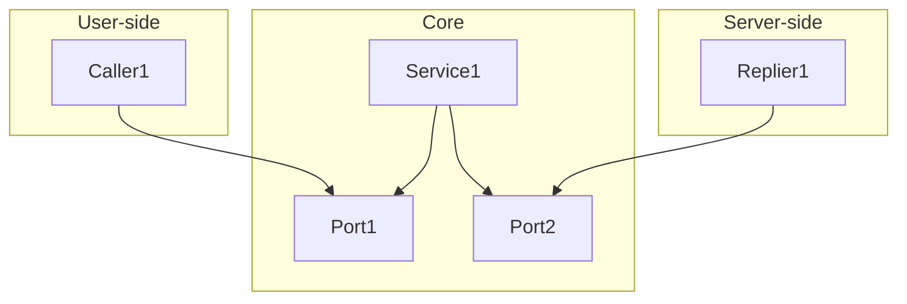
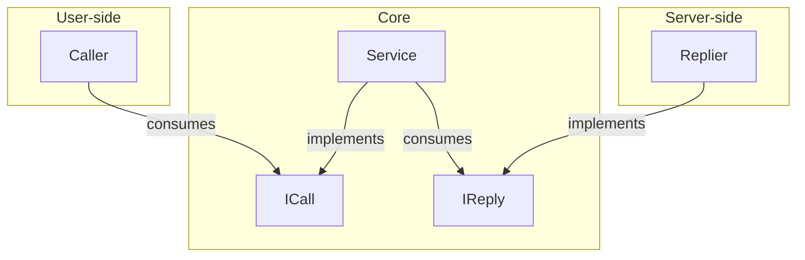

# Hexagonal pattern (ports and adapters)

Source 1: [Octo](https://blog.octo.com/architecture-hexagonale-trois-principes-et-un-exemple-dimplementation)

Source 2: [Herberto Graca](https://herbertograca.com/2017/11/16/explicit-architecture-01-ddd-hexagonal-onion-clean-cqrs-how-i-put-it-all-together/)

## What is a pattern?

A pattern is a template, a blueprint that provides a structured approach to solving common design problems.

This is mainly achieved by separating concerns: code is organized into functional components that can operate independently.

Proper use of patterns makes maintaining and scaling systems more easily.

However, avoiding over-separation is key as it can introduce unnecessary complexity.

## Ports and adapters model

This model explicitly separates code into three main parts:

- `left` → `user-side` : contains the components that handle user interfaces and interactions.

- `center` → `core` : contains the essential components of the system that manage business logic.

- `right` → `server-side` : contains the components that handle infrastructure interactions.



## Adapters

The components used by the system are called `adapters` :

- Core adapters are called `services`.
- User adapters are `callers`, they call and `tell` the core what to do.
- Server adapters are `repliers`, they reply after being `told` what to do by the core.

## Ports

Caller and replier adapters communicate with services through `doors` called ports.

In simple terms, a port is an `interface`.

## Practice 1

It's essential to organize `core` code files according to business logic, not static components:

instead of a folder called `ports` or `services`, a folder by action i.e. `CardProcessing`.

### Instantiation

From right to left:

```csharp
// Main entry point of the application.

class Program
{
    static void Main(string[] args)
    {
        // Server-side.
        IReply replier = new Replier(GetFilePath(@"ConsoleApp\CServer\pokemon-50-card-library.csv"));

        // Core.
        ICall service = new Service(replier);

        // User-side.
        var caller = new Caller(service);
        caller.Service.RequestCard();
    }

    public static string GetFilePath(string input)
    {
        string projectRootPath = Path.GetFullPath(Path.Combine(Directory.GetCurrentDirectory(), @"..\..\..\.."));
        return Path.Combine(projectRootPath, input);
    }
}
```

### Components

```csharp
// The Replier consumes a connection string to a file.

class Replier : IReply
{
    public string FilePath { get; set; }
    public Dictionary<string, Dictionary<string, string>> Cards { get; set; }

    public Replier(string filePath)
    {
        FilePath = filePath;
        Cards = new Dictionary<string, Dictionary<string, string>>();
    }
}
```

```csharp
// The Replier implements the IReply door to communicate with the service.

interface IReply
{
    public void ConvertCardData();

    public string FindCard(string input);

    public bool HandleResult(string input);
}

// The Service consumes the Replier.

class Service : ICall
{
    public IReply Replier { get; set; }

    public Service(IReply replier)
    {
        Replier = replier;
    }
}

// The Service implements the ICall door to communicate with the Caller.

interface ICall
{
    public void RequestCard();
}
```

```csharp
// The Caller consumes the service.

class Caller
{
    public ICall Service { get; set; }
        
    public Caller(ICall service)
    {
        Service = service;
    }
}
```

