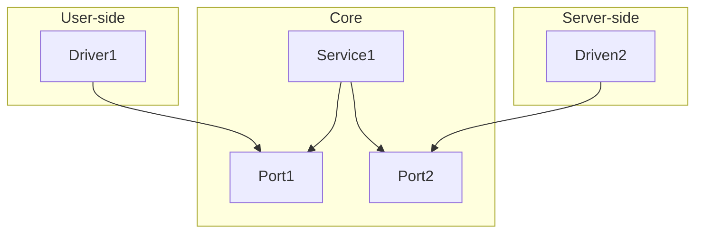

# Hexagonal pattern (ports and adapters)

Source 1: [Octo](https://blog.octo.com/architecture-hexagonale-trois-principes-et-un-exemple-dimplementation)

Source 2: [Herberto Graca](https://herbertograca.com/2017/11/16/explicit-architecture-01-ddd-hexagonal-onion-clean-cqrs-how-i-put-it-all-together/)

## What is a pattern?

A pattern is a template, a blueprint that provides a structured approach to solving common design problems.

This is mainly achieved by separating concerns: code is organized into functional components that can operate independently.

Proper use of patterns makes maintaining and scaling systems more easily.

However, avoiding over-separation is key as it can introduce unnecessary complexity.

## Ports and adapters model

This model explicitly separates code into three main parts:

- `left` → `user-side` : contains the components that handle user interfaces and interactions.

- `center` → `core` : contains the essential components of the system that manage business logic.

- `right` → `server-side` : contains the components that handle infrastructure interactions.

## Adapters

The components used by the system are called `adapters` :

- Core adapters are called `services`.
- User adapters are `drivers`, they `tell` the core what to do.
- Server adapters are `driven`, they are `told` what to do by the core.

## Ports

Driver and driven adapters communicate with services through `doors` called ports.

In simple terms, a port is an `interface`.

## Practice 1

