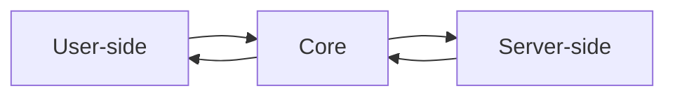
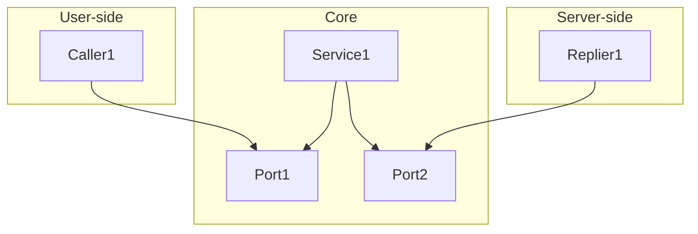
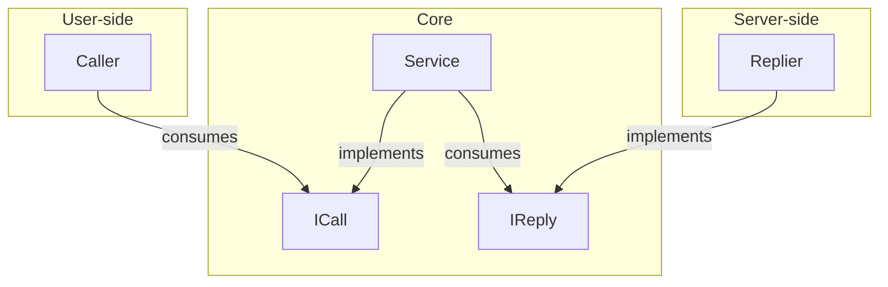
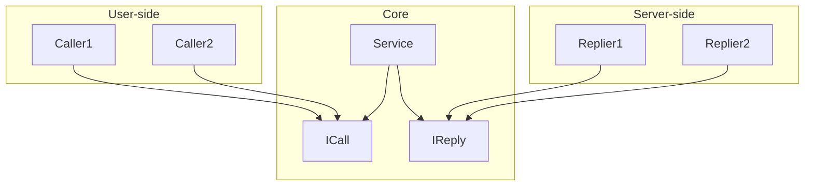

# Hexagonal pattern (ports and adapters)

Source 1: [Octo](https://blog.octo.com/architecture-hexagonale-trois-principes-et-un-exemple-dimplementation)

Source 2: [Herberto Graca](https://herbertograca.com/2017/11/16/explicit-architecture-01-ddd-hexagonal-onion-clean-cqrs-how-i-put-it-all-together/)

## TOC

<!--TOC-->
  - [What is a pattern?](#what-is-a-pattern)
  - [Ports and adapters model](#ports-and-adapters-model)
    - [Flow of the program](#flow-of-the-program)
  - [Adapters](#adapters)
    - [Core](#core)
  - [Ports](#ports)
  - [Practice 1](#practice-1)
    - [Instantiation](#instantiation)
    - [Components](#components)
    - [Tree](#tree)
    - [Implementation](#implementation)
    - [SOLID](#solid)
      - [S (single reponsibility)](#s-single-reponsibility)
      - [O (open closed)](#o-open-closed)
      - [D (dependency injection)](#d-dependency-injection)
      - [I (interface segregation)](#i-interface-segregation)
      - [L (substitution)](#l-substitution)
  - [Practice 2](#practice-2)
  - [Practice 3](#practice-3)
<!--/TOC-->

## What is a pattern?

A pattern is a model that provides a structured approach to solving common design problems in computing.

This is mainly achieved by separating concerns: code is organized into functional components that can operate independently.

Proper use of patterns helps maintain and scale systems more easily.

However, over-separating the code into many small classes and methods can be counterproductive, making the program harder to follow.

A balance is key for the model to be effective.

## Ports and adapters model

This model explicitly separates code into three main parts:

- `left` → `user-side` : contains the components that handle user interfaces and interactions.

- `center` → `core` : contains the essential components of the system that manage business logic.

- `right` → `server-side` : contains the components that handle infrastructure interactions.

### Flow of the program



## Adapters

The components used by the system are called `adapters` :

- Core adapters are called `services`.
- User adapters are `callers`, they call and `tell` the core what to do.
- Server adapters are `repliers`, they reply after being `told` what to do by the core.



### Core

The core can be organized as an adapter. 

Or it can be further abstracted using the [Onion pattern design](#).

## Ports

Caller and replier adapters communicate with services through `doors` called ports.

In simple terms, a port is an `interface`.

## Practice 1

This program is a console app simulating data search on a static database.

### Instantiation

From right to left:

```csharp
// Main entry point of the application.

class Program
{
    static void Main(string[] args)
    {
        // Server-side.
        IReply replier = new Replier(GetFilePath(@"HexagonalPattern\ConsoleApp\CServer\pokemon-50-card-library.csv"));

        // Core.
        ICall service = new Service(replier);

        // User-side.
        var caller = new Caller(service);
        caller.Service.RequestCard();
    }

    public static string GetFilePath(string input)
    {
        string projectRootPath = Path.GetFullPath(Path.Combine(Directory.GetCurrentDirectory(), @"..\..\..\.."));
        return Path.Combine(projectRootPath, input);
    }
}
```

### Components

```csharp
// The Replier consumes a connection string to a file.

class Replier : IReply
{
    public string FilePath { get; set; }
    public Dictionary<string, Dictionary<string, string>> Cards { get; set; }

    public Replier(string filePath)
    {
        FilePath = filePath;
        Cards = new Dictionary<string, Dictionary<string, string>>();
    }
}
```

```csharp
// The Replier implements the IReply door to communicate with the service.

interface IReply
{
    Dictionary<string, Dictionary<string, string>> Cards { get; }

    public void ConvertCardData();

    public string FindCard(string input);

    public bool HandleResult(string input);
}

// The Service consumes the Replier.

class Service : ICall
{
    public IReply Replier { get; set; }

    public Service(IReply replier)
    {
        Replier = replier;
    }
}

// The Service implements the ICall door to communicate with the Caller.

interface ICall
{
    public void RequestCard();

    public bool ProcessCard(string input);
}
```

```csharp
// The Caller consumes the service.

class Caller
{
    public ICall Service { get; set; }
        
    public Caller(ICall service)
    {
        Service = service;
    }
}
```

### Tree

In the project, core files can be organized by use case instead of unrelated components: `CardProcessing` instead of `ports` or `services`.

```terminal
ConsoleApp
├── AUser
│   └── Caller.cs
├── BCore
│   └── CardProcessing
│       ├── ICall.cs
│       ├── IReply.cs
│       └── Service.cs
└── CServer
    └── Files
    │   ├── pokemon-50-card-library.csv
    │   └── test-empty-file.csv
    └── Replier.cs
```

### Implementation

A console app writing Pokémon data from a `.csv` file to the console.

Data source: Copilot, based on data from PokéAPI.

```terminal
Please enter a Pokémon:
Please enter a Pokémon: hello
Card not found.

Please enter a Pokémon: pikachu

Pokémon: PIKACHU

Type: Electric
HP: 60
Attack: 55
Defense: 40
Rarity: Common
```



### SOLID

Five design principles intended to improve object-oriented patterns.

| Initial | Name | Description |
| --- | --- | --- |
| S | Single responsibility | A class should only have one job. |
| O | Open closed | A class should be open for extension but closed for modification. |
| L | Liskov substitution | Classes implementing interfaces should be replaceable.  |
| I | Interface segregation | A class should not be forced to apply interface logic it doesn't use. |
| D | Dependency inversion | Lower-level classes are plugged in to higher-level classes via interfaces only: dependencies go toward the center. |

The adapters and ports model allows to apply `SOLID` principles: 

#### S (single reponsibility)  

Classes are specialized: 

- `Replier` handles server-side needs.
- `Service` handles main logic.
- `Caller` handles user-side needs.

#### O (open closed)

In case of system extension, new components can apply interfaces (open) to ensure specific implementations do not break other components (closed):

```csharp
class Replier2 : IReply
{
    ...
    public void ConvertCardData()
    {
        // Specific implementation.
    }
    ...
}

class Replier3 : IReply
{
    ...
    public void ConvertCardData()
    {
        // Specific implementation.
    }
    ...
}
...
```

#### D (dependency injection)

Using interfaces, new adapters can be plugged in to the core from the outside, ensuring dependencies only go toward the center:



#### I (interface segregation)

If an adapter needs special implementation, a subinterface can be used to avoid overloading the main interface:

```csharp

interface IReply
{
    ...
    public void ConvertCardData();
    ...
}

interface IAdvancedReply : IReply
{
    public void AdvancedConvertCardData();
}

```

#### L (substitution)

Using subinterfaces, components can be replaced without breaking the system:

```csharp
class Replier2 : IReply
{
    ...
    public void ConvertCardData()
    {
        // Specific implementation.
    }
    ...
}

class Replier3 : IAdvancedReply
{
    ...
    public void ConvertCardData()
    {
        // Specific implementation.
    }
    ...
    public void AdvancedConvertCardData()
    {
        // Specific subimplementation.
    }
}
...
```

## Practice 2

This program is a console app simulating a front controller on the user-side, expanding on [Practice 1](#practice-1).

## Practice 3

This program is a console app simulating a load balancer on the server-side, expanding on [Practice 2](#practice-2).