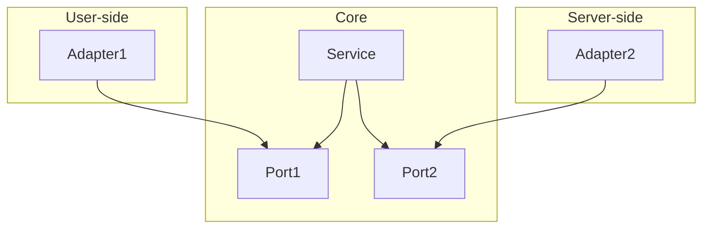

# Hexagonal pattern (ports and adapters)

Source 1: [Octo](https://blog.octo.com/architecture-hexagonale-trois-principes-et-un-exemple-dimplementation)

Source 2: [Herberto Graca](https://herbertograca.com/2017/11/16/explicit-architecture-01-ddd-hexagonal-onion-clean-cqrs-how-i-put-it-all-together/)

## What is a pattern?

A pattern is a template, a blueprint providing a structured approach to solving common design problems.

This is mainly done by separating concerns: code is organized into functional units that can operate independently.

Proper use of patterns makes maintaining and scaling systems more easily.

However, over-separation can be counterproductive, introducing complexity and reduce clarity.

## Ports and adapters model

This model explicitly separates code into an internal functional unit (the core)

and external functional units (the user and server-side):

### User-side

Starting from the left, the user-side contains the code running the user interface: routers, GUI components.

A user adapter (driving) or specific functional unit `tells` the core what to do.

### Core

Upon interaction, the user-side will trigger the core, which contains the code "actually making things happen".

This is the essence of the system.

### Server-side

If to make things happen, the core needs information, it can trigger the server-side to the right, to obtain data from a database for example.

The server-side responds to the core, which responds to the user-side to display the information.

A server adapter (driven) is `told` what to do by the core.

## Ports

Adapters communicate with the core through `doors` called ports.

In simple terms, a port is an `interface`.

## Driving adapters

Console commands, GUI components, routers; anything front-related that will trigger the core.

The core uses a specific door to access and consume the driving adapter.

## Driven adapters

Database queries, API calls to other services; anything back-related that will be consumed by the core.

The driven adapters implement the door needed to communicate with the core.

## Practice 1

